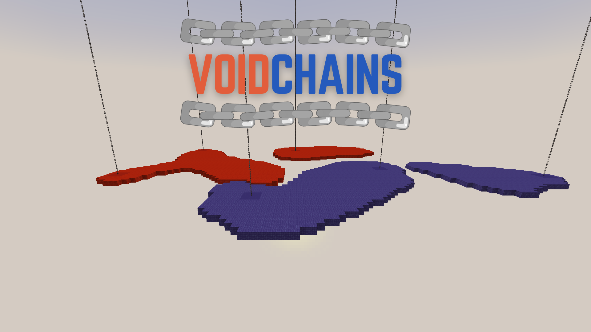

# Void Chains

> **AVAILABLE ON 1.21.10**
>
> **Click [here](https://github.com/AjjMC/Void-Chains/archive/refs/heads/main.zip) to download.**
>
> **For any queries, please use the issues section.**

> **RECOGNIZED BY MOJANG**
>
> **Featured on the official Minecraft Realms as part of the ["Survival: The Remix" release](https://www.minecraft.net/en-us/article/new-on-java-realms-survival-the-remix) (April 2025)!**

  

## Overview

Void Chains is a unique PvP minigame inspired by KOTH, Spleef, and other game modes. Two teams compete in an empty arena with Anchors and Bridges suspended over the void.

**A TEAM'S ANCHORS...**

* are generated upon game start.
* act as respawn points for the team.
* can be generated by the team on its Bridges.
* can be claimed by the other team.

**A TEAM'S BRIDGES...**

* can be formed from within the team's territory (Anchors and Bridges).
* collapse if they are not connected to any of the team's Anchors.
* override the other team's Bridges.

**A TEAM WITHOUT ANCHORS...**

* cannot respawn until an Anchor becomes available.
* loses if none of its players are able to play.

**THE POWERUP...**

* appears near the arena center.
* is activated by players holding it.
* gets destroyed if not collected on time.

**THE BORDER...**

* begins to shrink after some time.
* kills players and destroys Anchors.
* stops eventually, leaving enough space.

## Getting Started

* Join a team through your hotbar.
* Select a kit through your settings in the hotbar (or use default).
* Open the game menu through the Play barrel.
  - Adjust the game settings (or use default).
  - Start the game.
