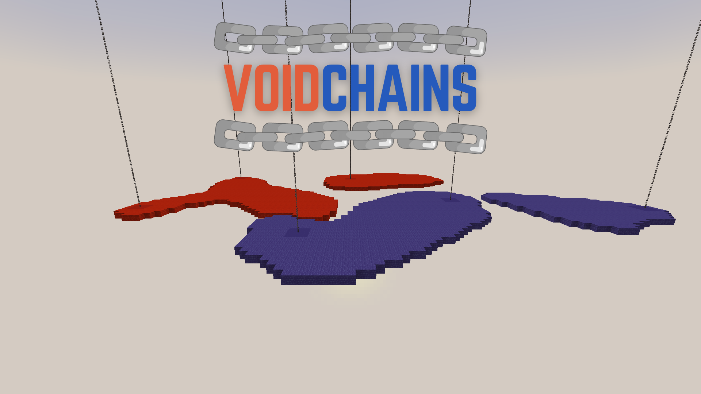

# Void Chains

  

Void Chains is a PvP-based minigame inspired by several elements of King of the Hill gamemodes, Splatoon, and Spleef. Two teams compete for domination in a dynamic landscape hanging in chains above the void. Using carefully-planned strategy and effective teamwork, players utilize fun mechanics to take down enemy territory and eliminate their adversaries.

## Downloading and Instructions

The minigame can be downloaded from this repository by clicking on "Code" and then "Download ZIP". The folder inside the ZIP file is the world.

Instructions:

* Open the "Play" menu
* Adjust the game's settings (optional)
* Join a team (unless random assignment is enabled)
* Select a kit (optional)
* Start a game (a player is required on each team)

## Gameplay

The game is played as follows:

*	Two teams begin with a number of anchor platforms assigned to each, suspended at random locations over the void, which serve as respawn points for players.

*	Players can form paths of their team color, starting from one of their anchor platforms, allowing them to expand their land and navigate across the void.

* If part of a territory is not attached to any anchor platforms of the same color, it collapses.

*	Players can use their paths to override the opposite color and detach enemy land from the anchor platforms supporting it, causing isolated blocks to fall and hence "spleefing" any players standing on top.

*	It is possible to walk into the opposing team's territory instead of overriding it, but paths cannot be generated from within the enemy color.

*	Players standing on enemy anchor platforms can claim them for their own team; new anchor platforms may also be generated in a team's own land.

*	The objective of the game is to eliminate the opposing team after claiming all of its anchor platforms and preventing enemy players from respawning upon death.

*	There is a world border around the arena that begins to shrink after some time, destroying all anchor platforms it touches and forcing players to fight in a smaller area.

*	Powerups periodically appear at random locations close to the arena's center, giving players different abilities for an amount of time; these items become available for a limited duration and are destroyed if not activated on time.
