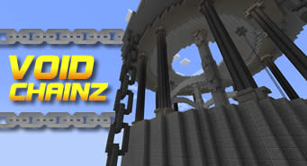

# Void Chains

  

  <i>Thumbnail made by StickyPiston Hosting.</i>

Void Chains is a strategic PvP-based minigame inspired by several elements of King of Hill gamemodes, Splatoon, and Spleef. As the name suggests, the action takes place in a void-based world, with two teams exploiting unique mechanics to eliminate their opponents and conquer the entire arena. A short gallery of pictures and GIFs of some of the minigame's features can be found [here](https://github.com/AjjMC/Void-Chains-Gallery).

## Downloading and Playing

The minigame can be downloaded from this repository by clicking on "Code" and then "Download ZIP". The folder inside the ZIP file is the world. The "PLAY" barrel in the lobby is used to adjust the game's settings, join a team and start the game.

## Gameplay

> *	Two teams begin with a number of anchor platforms assigned to each, suspended at random places over the void, which serve as potential respawn points for players.

> *	Players can form paths of their team color, starting from one of their anchors, allowing them to expand their land and navigate over the void. If part of a territory is not attached to any anchor platforms of the same color, it collapses.

> *	Paths created override the opposite color and may be used to detach enemy territory from anchors of the same color by isolating it, hence "spleefing" players standing on it.

> *	Players may walk into the opposing team's land instead of overriding it, which protects them from being "spleef-able" by opponents though at the cost of being unable to continue expanding their own territory.

> *	Anchor platforms may be claimed from the enemy team or generated in one's own land. Claimed anchor platforms have their color switched and therefore cease to respawn members of their former team or hold its territory from collapsing.

> *	The objective of the game is to eliminate the opposing team by claiming all of its anchor platforms and thus preventing opponents from respawning upon death.

> *	There is a world border around the arena that begins to shrink after some time, destroying all anchor platforms it touches and forcing players to fight in a smaller area while watching their step.

> *	A powerup periodically appears at random places close to the arena's center, giving players different abilities for an amount of time. This powerup is available for a limited duration and is destroyed if not activated on time.
