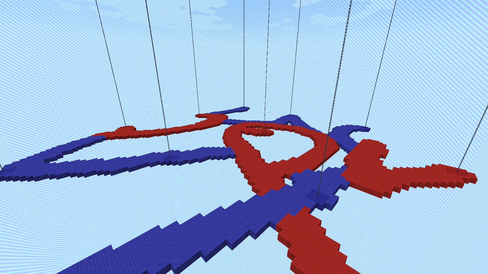
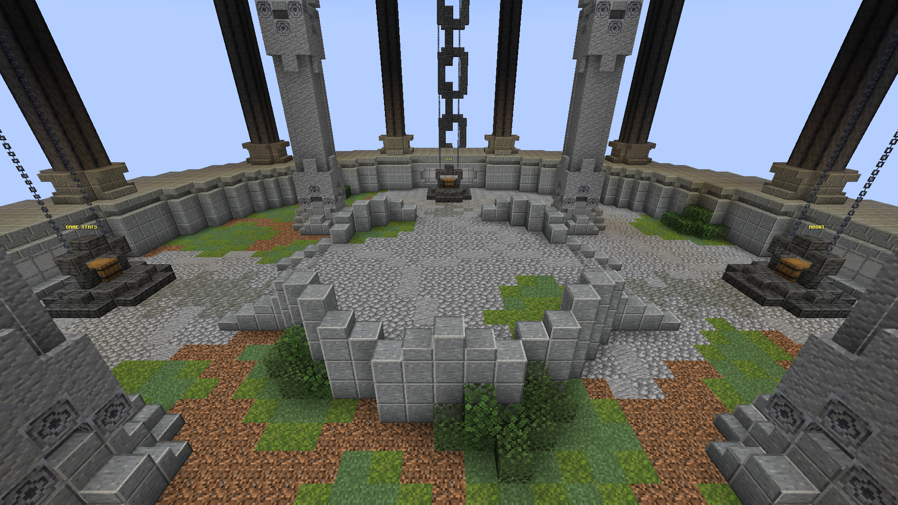
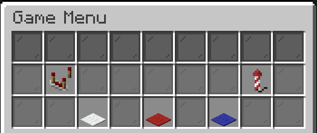
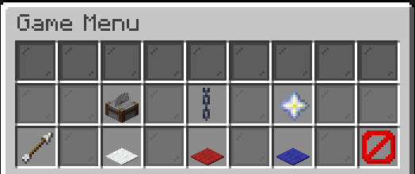
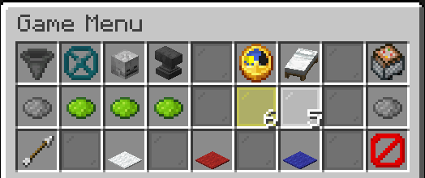
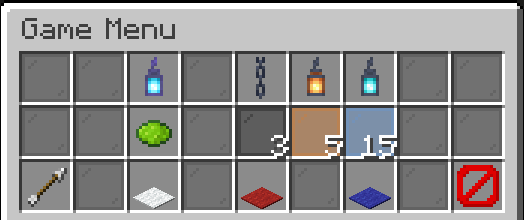
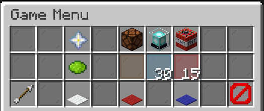

# Gallery

> This is a brief gallery of some of the game's features. *GIFs may take a few seconds to load.* The content shown here may have changed slightly (for the better) since the images and recordings were taken.

## Gameplay

### The arena during a game

  

### GIF: Land collapsing due to being detached from its anchor

  

### GIF: An anchor being claimed by the opposing team causing its surrounding land to collapse

  

### GIF: An anchor being destroyed by the world border causing its surrounding land to collapse

  

## Lobby

### The lobby

  

### GIF: A showcase of the game menu

  

### The main menu

  

### The settings menu

  

### The general settings menu

  

### The anchor settings menu

  

### The powerup settings menu

  

